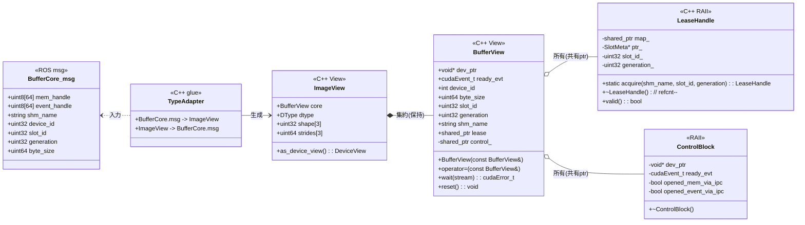
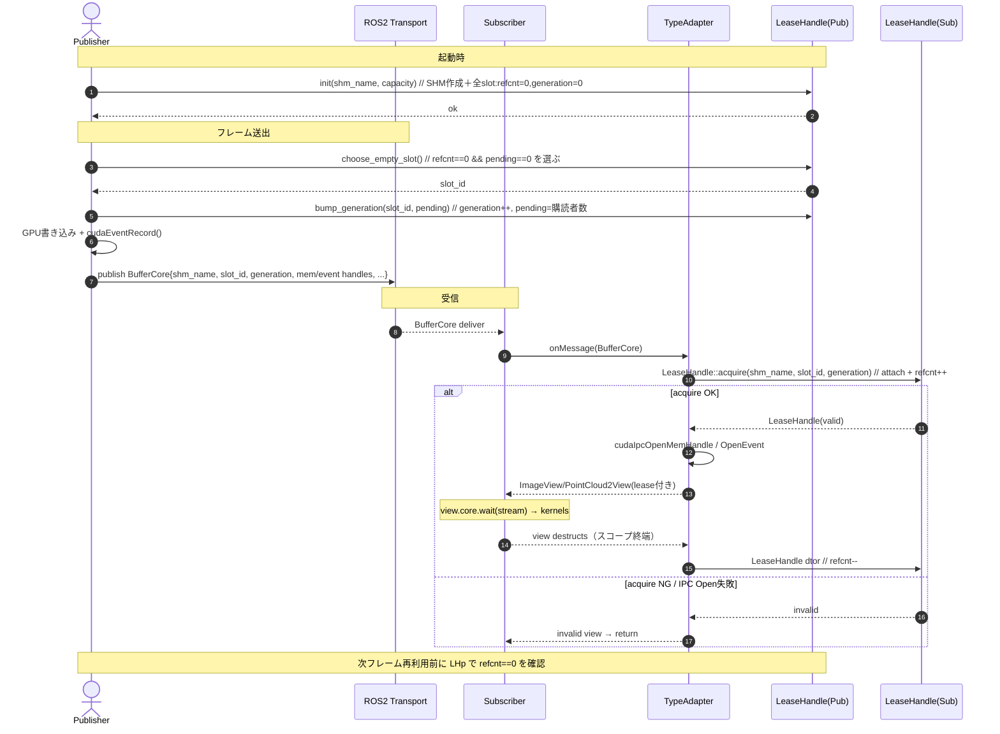

# LeaseHandle Design

## 用語

* **lease**：slot の利用権。Publisherが発行し、Subscriberが獲得・解放する。
* **slot**：バッファプール内のインデックス。各 slot は独立に lease を持つ。
* **generation**：slot の世代番号。Publisherが再利用時にインクリメントし、Subscriberは受信時に一致を確認する。
* **refcnt**：slot ごとのプロセス間参照カウント。
* **pending**：世代ごとに未取得の購読者数。Publisher が publish 前に設定し、各 Subscriber が初回取得で減算する想定。
* **SHM**：共有メモリ。slot メタ情報（refcnt, generation）を格納する。

## 概要

`LeaseHandle`は、ゼロコピー配信用バッファプールの各スロット (slot) に対し、プロセス間での利用寿命（lease）を参照カウントで管理する軽量RAIIユーティリティである。
GPUメモリやCUDA IPCとは疎結合で、(`shm_name`, `slot_id`, `generation`) をキーに 共有メモリ(SHM) 上のメタへアタッチし、`refcnt`を増減する。

共有メモリのマッピングはプロセス全体で `std::shared_ptr` を介してキャッシュされ、`LeaseHandle` は静的関数を通じて
必要時に `mmap` し、複数ハンドル間で再利用する。インスタンス化は `acquire()` のみから行われ、ハンドルは
参照カウントを保持するための最小限の状態（マッピング共有ポインタとスロットメタ情報）だけを格納する。

Subscriber 側で生成する `BufferView` は、この `LeaseHandle` を `std::shared_ptr` で保持しつつ、
CUDA IPC の Open/Close を司る Control block も共有する。これにより TypeAdapter の
ユーザー定義型が CopyConstructible であるという rclcpp の要件を満たしながら、最後の
インスタンス破棄でのみ `cudaIpcClose*` / `cudaEventDestroy` が実行される。

## 目的/要件

* 目的
  * slot の再利用安全性を、プロセス間でも保証する（最後の利用者が手放すまで再利用しない）。
* 要件
  * プロセス間参照カウント（acq/rel での正しい増減）。
  * 世代番号 (generation) による ABA回避（旧メッセージの遅延混入を破棄できる）。
  * Publisher単一writer前提での簡潔な運用（ロックレス）。
  * 例外非依存：失敗時は無効ハンドルを返し、呼び手が判断可能。

### スコープ外

CUDA IPCのopen/close、GPUイベント同期、DDS/RMWの詳細。

## 外部インターフェース（ROS側の前提）

* 各メッセージ（`GpuImage`, `GpuPointCloud2`）内の`BufferCore`が以下を提供：
  * `shm_name`（トピック固有のSHM識別子）
  * `slot_id`（バッファプール内インデックス）
  * `generation`（再利用時に増加）
* Subscriberはこの3つをキーにLeaseを獲得（=`refcnt++`）、破棄時に`refcnt--`。

## 共有メモリ（SHM）レイアウト

名前・作成
* 命名例：`/t2sw_<ns>_<topic>_<uuid8>`（衝突回避のために末尾に短いUUID）。
* 作成者：Publisherが作成＆初期化、Subscriberはattachのみ。

## 構造（最小）

```cpp
struct ShmHeader {
  uint32_t magic;           // 'LSE1'
  uint32_t layout_version;  // 2
  uint32_t capacity;        // slot数
  uint32_t consumer_count;  // Publisher が観測した購読者数
};

struct SlotMeta {
  uint32_t generation;  // as_atomic() で std::atomic<uint32_t> として扱う
  uint32_t refcnt;      // 同上
  uint32_t pending;     // 同上
  uint32_t reserved;    // アライン調整
};

struct ShmArea {
  ShmHeader hdr;
  SlotMeta  slots[capacity];  // 実装は可変長配列
};
```

実装では共有メモリ互換性を保つため `uint32_t` をそのまま配置し、必要な場面で `as_atomic()` ヘルパーを通じて
`std::atomic<uint32_t>` 参照に再解釈して操作する。C++20 の `std::atomic_ref` と同じ意図で、配置レイアウトを
崩さずにアトミック操作だけを付与している。

## ライフサイクル/状態遷移

### Publisher（単一writer）

1. 初期化
LeaseHandle::init(shm_name, capacity) を起動時に一度呼び、SHM を作成・初期化（全 refcnt=0, generation=0）。

2. 発行準備
空き slot を選ぶ（refcnt==0 かつ pending==0 を確認）。`bump_generation(shm_name, slot_id, pending_count)` を呼び、選択した slot の generation++ と `pending` 初期値設定（`get_subscription_count()` 等で得た購読者数）を同時に行う。

3. GPU 書き込み
対応する GPU バッファへ書き込み、完了イベントを cudaEventRecord()。

4. メッセージ送出
BufferCore{ shm_name, slot_id, generation, mem_handle, event_handle, byte_size, … } を publish。

5. 再利用チェック
次回同じ slot を使う前に 必ず `refcnt==0 && pending==0` を再確認。どちらかが非ゼロならその slot はスキップ／隔離する。
必要に応じて Publisher 側で TTL を設け、期限切れの slot に対して `force_clear_pending()` を呼び出して pending を強制的に 0 に戻すことでリソースを回収する。

### Subscriber

1. 取得（acquire）
受信した BufferCore を受け、LeaseHandle::acquire(shm_name, slot_id, generation) を呼ぶ。
   * attach 成功かつ generation 一致で refcnt.fetch_add(1, acq_rel)。
   * その後に cudaIpcOpenMemHandle / cudaIpcOpenEventHandle を実行。
   * もし CUDA IPC open が失敗したら refcnt.fetch_sub(1, acq_rel) で取り消し、無効 View を返す（例外は使わない）。

2. 利用（use）
TypeAdapter が BufferView / ImageView / PointCloud2View を構築して返す。
`LeaseHandle` は View の内部で `std::shared_ptr` として保持され、利用者は必要に応じて
`view.core.wait(stream)` を呼び、カーネルを stream に投入。

3. 解放（release）
View の破棄に伴い、内部で保持する LeaseHandle のデストラクタが呼ばれ、refcnt.fetch_sub(1, acq_rel)。
これにより当該 slot は Publisher 側で再利用可能（refcnt==0）となる。

## 制限事項

* `LeaseHandle::init()` は対象の共有メモリ領域全体を初期化するため、同じ `shm_name` を複数 Publisher が共有する構成は非対応。複数 Publisher が同じ領域を操作すると世代や参照カウントが競合し、データ破損を招く。トピックごと（Publisher インスタンスごと）にユニークな共有メモリ名を割り当てること。

## LeaseHandle API

```cpp
class LeaseHandle {
public:
  // ==============================
  // Publisher 側ユーティリティ
  // ==============================

  // SHM 作成・初期化（起動時に1回だけ呼ぶ）
  static bool init(const std::string& shm_name, uint32_t capacity);

  // 空き slot を選択（refcnt==0 かつ pending==0 の slot_id を返す）
  static std::optional<uint32_t> choose_empty_slot(const std::string& shm_name);

  // 参照用ヘルパー
  static std::optional<uint32_t> current_generation(const std::string& shm_name,
                                                    uint32_t slot_id);
  static std::optional<uint32_t> current_refcount(const std::string& shm_name,
                                                  uint32_t slot_id);
  static std::optional<uint32_t> current_pending(const std::string& shm_name,
                                                 uint32_t slot_id);

  // 監視情報の更新（publish 直前に呼ぶ）
  static std::optional<uint32_t> bump_generation(const std::string& shm_name,
                                                 uint32_t slot_id,
                                                 uint32_t pending);

  // TTL等で pending を強制開放するためのヘルパー（refcnt==0 の場合のみ0に戻す）
  static bool force_clear_pending(const std::string& shm_name,
                                  uint32_t slot_id);

  // ==============================
  // Subscriber 側ユーティリティ
  // ==============================

  // 取得：attach + generation一致確認 + refcnt++
  // 失敗時は例外を投げず invalid を返す
  static LeaseHandle acquire(const std::string& shm_name,
                             uint32_t slot_id,
                             uint32_t generation);

  ~LeaseHandle();  // valid なら refcnt--
  LeaseHandle(LeaseHandle&&) noexcept;
  LeaseHandle& operator=(LeaseHandle&&) noexcept;
  LeaseHandle(const LeaseHandle&) = delete;
  LeaseHandle& operator=(const LeaseHandle&) = delete;

  bool     valid() const noexcept;
  uint32_t slot_id() const noexcept;
  uint32_t generation() const noexcept;

private:
  struct Mapping;
  struct SlotMeta;

  LeaseHandle() = default;
  LeaseHandle(std::shared_ptr<Mapping> mapping,
              SlotMeta* slot,
              uint32_t slot_id,
              uint32_t generation);

  void release() noexcept;

  std::shared_ptr<Mapping> mapping_;
  SlotMeta* slot_meta_ = nullptr;
  uint32_t slot_id_ = 0;
  uint32_t generation_ = 0;

  static std::shared_ptr<Mapping> attach(const std::string& shm_name);
  static std::mutex& registry_mutex();
  static std::unordered_map<std::string, std::shared_ptr<Mapping>>& registry();
};
```

**方針**

* 例外非依存：acquire() は無効ハンドルで返す＋ログ（WARN/DEBUG）に留める。
* move-only：二重解放を防止。
* SHM lifetime：`Mapping` を `shared_ptr` で共有し、`munmap()` は `Mapping` のデストラクタで処理する。

## 並行性 / メモリ順序（最小規定）

* `refcnt`：`fetch_add(1, std::memory_order_acq_rel)` / `fetch_sub(1, std::memory_order_acq_rel)`
* `generation`（Subscriber 側の参照）：`load(std::memory_order_acquire)`
* `generation`（Publisher 側の更新）：`bump_generation(..., pending)` 内で `store(new_value, std::memory_order_release)`
* `pending`（Subscriber 側の参照）：`load(std::memory_order_acquire)`
* `pending`（Publisher 側の更新）：同じ `bump_generation()` 呼び出しで `store(new_value, std::memory_order_release)`
  * publish 直前の `bump_generation(..., pending)` により `generation`→`pending` の順で store され、未取得購読者の把握とスロット再利用条件を同時に満たす。

## Adapter との責務分担（位置づけ）

* TypeAdapter（ROS→View） は、まず`LeaseHandle::acquire()`を試みる。
  * 成功：Lease が有効になった時点で CUDA IPC open を行い、View を構築。
    * BufferView は Control block (`shared_ptr`) を共有し、コピー後も `cudaIpcClose*` や
      `cudaEventDestroy` が 1 度だけ実行される。
  * 失敗：無効 View を返してコールバック側で破棄（例外は使わない）。
* View の RAII（Control block + LeaseHandle）により、最後の View 破棄で
  `cudaIpcClose*` / `cudaEventDestroy` / `refcnt--` が連鎖的に実行される。


# 付録：運用ガイド

## 障害と回復

### 典型的な障害ケースと対処

| 障害                         | 兆候                                 | 直近の対処                         | 根本対策                              |
| -------------------------- | ---------------------------------- | ----------------------------- | --------------------------------- |
| **Leaseリーク（refcnt>0が長時間）** | 同一 slot が再利用できず遅延が蓄積               | しきい値超過で slot を隔離、長期で SHM を再生成 | Lease短命化（GPUストリーム完了時の自動解放）、長期保持禁止 |
| **世代不一致（旧メッセージ遅延）**        | Subscriber で `generation` mismatch | 即破棄（debug/trace ログのみ）         | QoS・経路調整                          |
| **CUDA IPC Open失敗**        | `cudaErrorInvalidResourceHandle` 等 | 無効 View を返し破棄                 | device選択や publisher 側 GPU 固定      |
| **SHM attach失敗**           | `shm_open`/`mmap` 失敗               | 無効 Lease を返却 → 無効 View → 破棄   | 起動順序・権限設定調整                       |
| **refcnt破損**               | refcnt アンダーフロー                     | ERROR ログを出し slot を隔離          | SHM 実装見直し・再生成                     |

**ポリシー**

* Open/attach 失敗は例外にせず **無効Viewを返却**。
* コールバック側は `if (!view.valid()) return;` を徹底。

### 回復フロー（Publisher側）

1. **起動時**：全 slot の refcnt を走査。`>0` は古世代扱いで再利用禁止。多数なら SHM 再生成。
2. **運転中**：refcnt>0 がしきい値時間を超過した slot を隔離。隔離率が閾値を超えたら SHM 再生成。
3. **SHM再生成**：新しい `shm_name` を発行し publish。旧領域は refcnt==0 後に GC。

閾値目安：

* 滞留時間 T = 500ms〜2s
* 隔離率 R = 25%

## ログ方針

### レベル指針

* **ERROR**：refcnt不整合、SHM破損、重大CUDAエラー
* **WARN**：slot隔離、SHM再生成、attach失敗の持続
* **INFO**：初期化、切替成功、回復完了
* **DEBUG**：世代不一致、単発の open/attach 失敗
* **TRACE**：詳細トレース

### ログ例

* `WARN  lease:slot_isolated slot=7 refcnt=3 age_ms=742 reason=stalled`
* `WARN  lease:shm_rolled old=/t2sw_cam0_a1b2 new=/t2sw_cam0_c3d4 reason=slot_exhausted`
* `DEBUG lease:generation_mismatch slot=3 msg_gen=42 cur_gen=43`
* `ERROR lease:refcnt_corrupt slot=2 refcnt=4294967295 action=quarantine`

**補足**

* ログは共通タグ `lease:` を先頭に付与。
* バースト抑制：同一slotの WARN は 1回/秒まで。

## テレメトリ

### コアKPI（必須）

* `lease.refcnt_current{slot}` (gauge): 現在の refcnt
* `lease.slot_isolated_total` (counter): slot隔離発生回数
* `lease.shm_roll_total` (counter): SHM再生成回数
* `lease.acquire_fail_total` (counter): attach 失敗など
* `lease.ipc_open_fail_total` (counter): CUDA IPC open失敗
* `lease.reuse_wait_ms` (histogram): slot再利用待ち時間
* `lease.lifetime_ms` (histogram): Lease の寿命

### 参考KPI（推奨）

* `lease.active_slots` (gauge): refcnt>0 の slot 数
* `lease.isolated_slots` (gauge): 隔離中の slot 数
* `lease.queue_depth` (gauge): Publisher 側待機フレーム数
* `lease.gen_skips_total` (counter): 世代不一致破棄回数

### アラート初期値（例）

* 隔離率 >25% が30秒継続 → Warn
* 1分間に SHM 再生成 >=3回 → Warn
* 5分間で acquire\_fail >100 → Warn

### サンプリング

* メトリクス更新は lock-free。
* ヒストグラムは 1/10 サンプリングから開始。

## 運用メモ

* Lease は短命化が基本。GPUストリーム完了時に `cudaLaunchHostFunc` 等で自動解放。
* 回復は段階的に：slot隔離 → 割合監視 → SHM再生成。
* メトリクスとアラートを最初から用意し、静かに悪化しないよう監視。

## 図解

### クラス図



### シーケンス図


